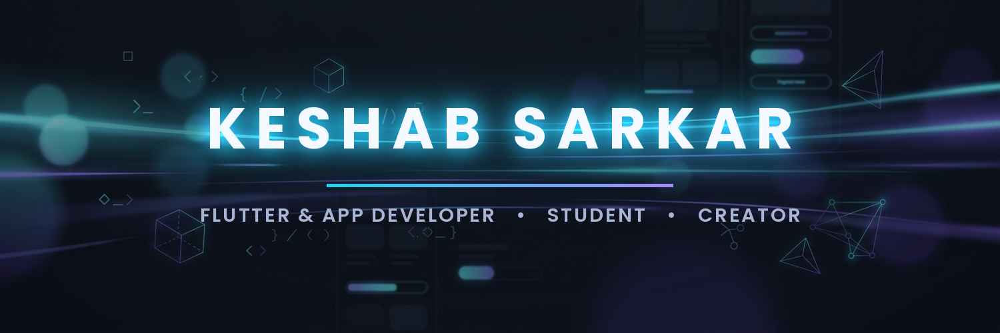

<div align="center">




<br>

<a href="https://github.com/Keshab1997?tab=repositories"></a>
<a href="https://github.com/Keshab1997?tab=followers"></a>
<a href="https://github.com/Keshab1997?tab=repositories"></a>

</div>

<div align="center"></div>

## 💫 About Me

<div align="center">

```js
const keshab = {
    name     : "Keshab Sarkar",
    role     : "App Developer & Student",
    location : "Purba Bardhaman, West Bengal, India 🇮🇳",
    languages: ["Bengali", "English", "Hindi"],
    stack    : ["Flutter", "Dart", "TypeScript", "JavaScript"],
    currently: "Building AI-powered mobile & web apps 🤖",
    motto    : "Dream big. Work hard. Stay humble. ✨"
};
```

<sub>❝ Dream big. Work even harder. ❞</sub>

</div>

<div align="center"></div>

## 🚀 Featured Projects

<table>
  <tr>
    <td width="50%">
      <h3 align="center">🗣️ SpeakEasy</h3>
      <p align="center"><b>AI English Speaking Partner</b> — full-featured Flutter app for Bengali speakers: 70+ grammar lessons, AI conversation, listening, gamification & more.</p>
      <p align="center">
        
        
        <a href="https://github.com/Keshab1997/SpeakEasy"></a>
      </p>
    </td>
    <td width="50%">
      <h3 align="center">🎯 Quizbaaz</h3>
      <p align="center"><b>Premium 3D Gamified Quiz App</b> — chapter question bank, daily live quizzes, yesterday champion gifts, streaks & full admin panel.</p>
      <p align="center">
        
        
        <a href="https://github.com/Keshab1997/quizbaaz"></a>
      </p>
    </td>
  </tr>
  <tr>
    <td width="50%">
      <h3 align="center">🎵 Sonic Bloom Player</h3>
      <p align="center"><b>Music streaming player</b> — sleek web player for an immersive listening experience.</p>
      <p align="center">
        
        <a href="https://sonic-bloom-player.vercel.app"></a>
        <a href="https://github.com/Keshab1997/sonic-bloom-player"></a>
      </p>
    </td>
    <td width="50%">
      <h3 align="center">🤖 AI Image Scan</h3>
      <p align="center"><b>AI-powered image scanning</b> — smart analysis & recognition at your fingertips.</p>
      <p align="center">
        
        <a href="https://github.com/Keshab1997/AI-Image-Scan"></a>
      </p>
    </td>
  </tr>
  <tr>
    <td width="50%">
      <h3 align="center">📚 Study With Keshab</h3>
      <p align="center"><b>Study hub</b> — notes & learning resources for students.</p>
      <p align="center">
        
        <a href="https://github.com/Keshab1997/Study-With-Keshab"></a>
      </p>
    </td>
    <td width="50%">
      <h3 align="center">📱 APK Making Guide</h3>
      <p align="center"><b>Step-by-step guide</b> — build & ship Android apps from scratch.</p>
      <p align="center">
        
        <a href="https://github.com/Keshab1997/Apk-Making-Guide"></a>
      </p>
    </td>
  </tr>
</table>

<div align="center"></div>

## 🛠️ Tech Arsenal

<div align="center">

**📱 Mobile Development**


**🌐 Web Development**


**⚙️ Tools & Cloud**


</div>

<div align="center"></div>

## 📊 GitHub Analytics

<div align="center">
  
  
</div>

<div align="center">
  
  
</div>

<div align="center">
  
</div>

<div align="center">

### 🐍 Watch my contribution snake eat my commits!

<picture>
  <source media="(prefers-color-scheme: dark)" srcset="https://raw.githubusercontent.com/Keshab1997/Keshab1997/output/github-snake-dark.svg">
  <source media="(prefers-color-scheme: light)" srcset="https://raw.githubusercontent.com/Keshab1997/Keshab1997/output/github-snake.svg">
  
</picture>

</div>

<div align="center"></div>

## 📫 Connect With Me

<div align="center">

<a href="https://github.com/Keshab1997"></a>
<a href="https://keshab1997.github.io"></a>
<a href="https://github.com/Keshab1997?tab=repositories"></a>

<br><br>


</div>

<br>

<div align="center">
  
</div>