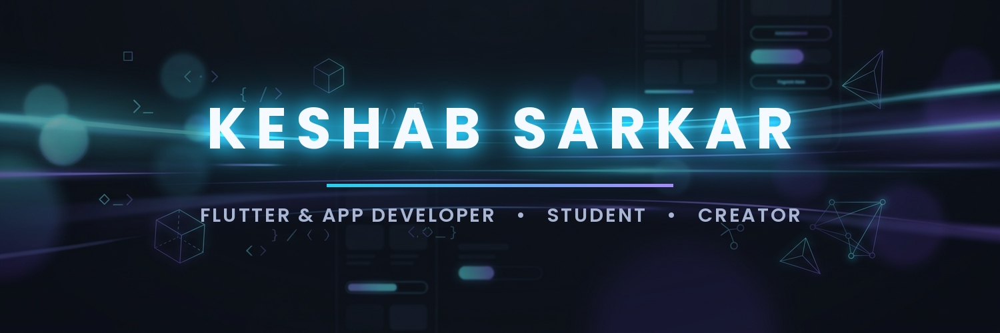
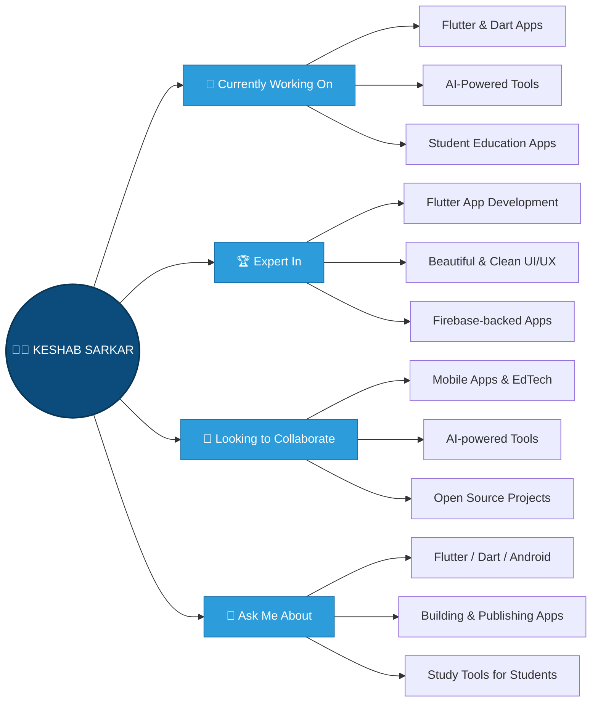

<!-- ══════════════════ HEADER ══════════════════ -->

<h1> Hi there! I'm <b>Keshab Sarkar</b></h1>

### 🇮🇳 *Welcome! I'm from West Bengal, India — I build apps with Flutter, for students.* 🇮🇳

  
  
  

---

##  About Me

> *"Dream big. Work even harder. Stay humble."* ✨

```mermaid
%%{init: {"flowchart": {"nodeSpacing": 25, "rankSpacing": 55}}}%%
flowchart LR
    ME(("🧑‍💻 KESHAB SARKAR"))

    ME --> CW["🚀 Currently Working On"]
    CW --> CW1[Flutter & Dart Apps]
    CW --> CW2[AI-Powered Tools]
    CW --> CW3[Student Education Apps]

    ME --> EX["🏆 Expert In"]
    EX --> EX1[Flutter App Development]
    EX --> EX2[Beautiful & Clean UI/UX]
    EX --> EX3[Firebase-backed Apps]

    ME --> COL["🤝 Looking to Collaborate"]
    COL --> COL1[Mobile Apps & EdTech]
    COL --> COL2[AI-powered Tools]
    COL --> COL3[Open Source Projects]

    ME --> ASK["💬 Ask Me About"]
    ASK --> ASK1[Flutter / Dart / Android]
    ASK --> ASK2[Building & Publishing Apps]
    ASK --> ASK3[Study Tools for Students]

    style ME fill:#0B4C7C,stroke:#083656,stroke-width:2px,color:#fff
    style CW fill:#2D9CDB,stroke:#1B6FA8,color:#fff
    style EX fill:#2D9CDB,stroke:#1B6FA8,color:#fff
    style COL fill:#2D9CDB,stroke:#1B6FA8,color:#fff
    style ASK fill:#2D9CDB,stroke:#1B6FA8,color:#fff
```

---

## 🛠️ Tech Stack & Skills

### 📱 Mobile Development

### 🌐 Web Development

### 🤖 AI & Tools

---

## 🚀 Featured Projects

<table>
  <tr>
    <td width="50%">
      <h3 align="center">🗣️ SpeakEasy</h3>
      
<b>AI English Speaking Partner</b> — full Flutter app for Bengali speakers: 70+ grammar lessons, AI conversation, listening practice & gamification.

      

        
        
        
      

    </td>
    <td width="50%">
      <h3 align="center">🎯 Quizbaaz</h3>
      
<b>Premium 3D Gamified Quiz App</b> — chapter question bank, daily live quizzes, champion gifts, streaks & full admin panel.

      

        
        
        
      

    </td>
  </tr>
  <tr>
    <td width="50%">
      <h3 align="center">📸 Docify</h3>
      
<b>Photo, PDF & CV Toolkit</b> — resize photos & signatures, compress PDFs, build CVs — all in one Flutter app.

      

        
        
        
      

    </td>
    <td width="50%">
      <h3 align="center">🧠 KeepIt</h3>
      
<b>AI Second Brain & Bookmark Manager</b> — save, organize & rediscover anything with smart AI-powered visual bookmarks.

      

        
        
        
      

    </td>
  </tr>
  <tr>
    <td width="50%">
      <h3 align="center">📚 Study With Keshab</h3>
      
<b>বাংলা Study Hub</b> — MCQ quizzes, practice sets, current affairs & CBT exam platform for students.

      

        
        
        
      

    </td>
    <td width="50%">
      <h3 align="center">📄 Bangla PDF OCR</h3>
      
<b>বাংলা PDF থেকে টেক্সট</b> — Python tool to extract text from Bangla PDFs — built for real local needs.

      

        
        
        
      

    </td>
  </tr>
</table>

---

## 📊 GitHub Stats

<table>
  <tr>
    <td width="50%" valign="top">
      
       
      
       
      
    </td>
    <td width="50%" valign="center">
      
    </td>
  </tr>
</table>

---

## 📈 Activity Graph

---

## 🎯 Current Focus

- **📱 Mobile Apps:** Polishing Flutter apps that solve real problems for students
- **🤖 AI Integration:** Gemini & OpenAI powered features inside everyday apps
- **📚 EdTech:** *Study With Keshab* — Bangla learning tools, quizzes & exam practice
- **🌱 Learning:** Advanced Flutter architecture, animations & clean UI craft

---

## 🐍 Contribution Snake

### Watch my contribution snake eat the commits! 🍒

<picture>
  <source media="(prefers-color-scheme: dark)" srcset="https://raw.githubusercontent.com/Keshab1997/Keshab1997/output/github-snake-dark.svg">
  <source media="(prefers-color-scheme: light)" srcset="https://raw.githubusercontent.com/Keshab1997/Keshab1997/output/github-snake.svg">
  
</picture>

---

## 📫 Let's Connect!

**🚀 Let's build something amazing together!**

  

 

